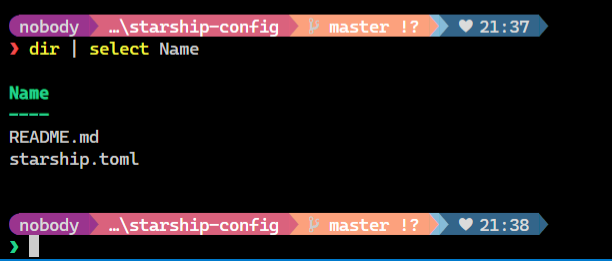

# My Starship Config
A repo for my custom [Starship prompt](https://starship.rs/) configuration.

## Setup
For this you will need:
1. Starship prompt installed
1. A [Nerd Font](https://www.nerdfonts.com/font-downloads) installed - Caskaydia Cove works nicely in Windows Terminal
1. Copy `starship.toml` into `~/.config` folder
1. Configure Window Terminal to use the Nerd Font
1. Configure VSCode editor to use the Nerd Font:
    * Settings > Text Editor > Font > Font Family = 'CaskaydiaCove NF', 'Cascadia Code PL', Consolas, 'Courier New', monospace
1. Configure VSCode terminal to use the Nerd Font:
    * Settings > Features > Terminal > Integrated: Font Family = 'CaskaydiaCove NF', 'Cascadia Code PL', Consolas, 'Courier New', monospace